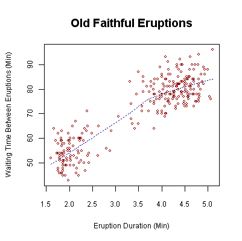

# luarefnos

Pure lua implementation of table, figure, section and equation
cross-references.

## Sample usage

``` markdown
# Chapter 1

In-text references to @fig:1 [B] and @tab:foobar.

Multi-reference to [@fig:1 (A); the cool part of @fig:1; @fig:three]
and [@tab:foobar (very cool); *especially* @tab:foobar].

{#fig:1 width=1in}

{#fig: width=1in}

{#fig:three width=1in}

Plot [-@fig:three] is given above, without adding the "Figure" prefix.

As seen in @tab:foobar, commas are handled properly.

## Equations {#equationchapter}

Equations, such as @eq:pythagoras, have to be put into a span with an id:

[$$a^2 + b^2 = c^2$$]{#eq:pythagoras}

## Tables

Foo Bar
--- ---
1   2

Table: With caption string {#tab:foobar border=1 attr2=foo}
```

## Sample output

### Chapter 1

In-text references to Figure [1](#fig:1)B and Table [1](#tab:foobar).

Multi-reference to Figures [1](#fig:1) (A), the cool part of [1](#fig:1)
& [3](#fig:three) and Tables [1](#tab:foobar) (very cool) & *especially*
[1](#tab:foobar).

<figure>
<figcaption aria-hidden="true">Figure 1: The number one.</figcaption>
</figure>

<figure>
<figcaption aria-hidden="true">Figure 2: The unlabeled number two.</figcaption>
</figure>

<figure>
<figcaption aria-hidden="true">Figure 3: The number three.</figcaption>
</figure>

Plot [3](#fig:three) is given above, without adding the “Figure” prefix.

As seen in Table [1](#tab:foobar), commas are handled properly.

#### Equations

Equations, such as Equation [1](#eq:pythagoras), have to be put into a
span with an id:

<span id="eq:pythagoras">
*a*<sup>2</sup> + *b*<sup>2</sup> = *c*<sup>2</sup>
</span>

#### Tables

| Foo | Bar |
|:----|:----|
| 1   | 2   |

<span id="tab:foobar">Table 1:</span>With caption string

# What about pandoc-xnos

| Feature                | luarefnos |     pandoc-xnos     |
|:-----------------------|:---------:|:-------------------:|
| Figure references      |     ✔     |          ✔          |
| Subfigures             |    (✗)    |          ✔          |
| Table references       |     ✔     |          ✔          |
| Equation references    |     ✔     |          ✔          |
| Section references     |    (✔)    |          ✔          |
| Clever references      |     ✗     |          ✔          |
| Customization          |     ✗     |          ✔          |
| Maturity               |     👶     |          ✔          |
| Corner cases           |   Many    |    Probably none    |
| Installation           | One file  | Python + 3 packages |
| Native docx references |     ✔     |          ✗          |

# Usage

Before anything can be referenced, it has to have an ID.

## Figures

The native attribute syntax is reused:

``` markdown
{#fig:example}
```

## Tables

A (not yet) native attribute block is at the end of the caption is
applied to the table:

``` markdown
Col A Col B
----- -----
    1     2

: A table caption {#tab:example}
```

## Equations

Display math in a span with an ID is counted:

``` markdown
[$$a^2 + b^2 = c^2$$]{#eq:pythagoras}
```

## Sections

Section IDs are re-used, the `sec:` is added automatically!

``` markdown
# Section A

The section below has the number @sec:someotherid

# Section B {#someotherid}
```

## Referencing

Citations with a namespace (e.g. `sec:`, `fig:` etc.) are replaced with
the reference:

``` markdown
We reference @tab:example and @fig:example.
```
